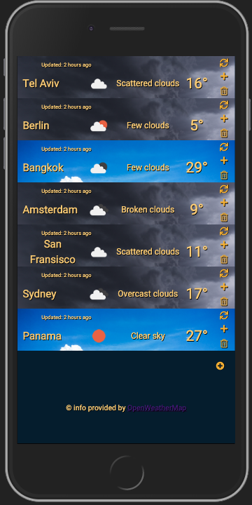
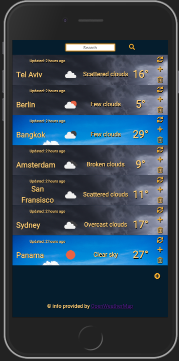

# Weather-App

Weather-App is an app built with Javascript(jQuery) for mobile. The app allows you to get weather information by city.

Weather info provided by OpenWeatherMap(https://openweathermap.org/)

Demo: [https://rons-weatherapp.herokuapp.com](https://rons-weatherapp.herokuapp.com)

## Table Of Contents
- [Weather-App](#weather-app)
  - [Table Of Contents](#table-of-contents)
  - [Running the project](#running-the-project)
  - [Screenshots](#screenshots)
    - [Main screen](#main-screen)
    - [Search bar](#search-bar)
  - [Tech-stack](#tech-stack)

## Running the project
1. Clone the repo.
2. Run `npm install`.
3. Run `node server.js`
4. Run `mongod`
5. Navigate to `http://localhost:3080`.

## Screenshots

### Main screen

### Search bar

## Tech-stack
1. jQuery, Handlebars
2. Express(Node.js)
3. Mongoose(MongoDB)
4. request-promise
5. xml2js